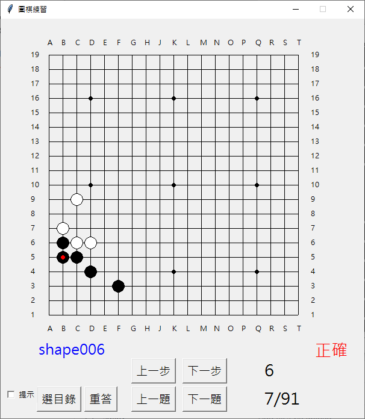

# weiqigo
A weiqi go tool. 圍棋打譜死活練習程式

這是一個以python+tk所寫成的小程式。可以將儲存為sgf格式的定石、詰棋、死活、棋形作為練習。</BR>
跟一般的打譜程式有何不同：這個程式是以作死活的方式練習sgf，強調是否記住正確的著手。



## License
本程式為 MIT License ，所使用部份程式有各自的 License ，分別為

* [sgf.py](https://github.com/jtauber/sgf)  (sgf檔案格式parsing)
* [board.py](https://github.com/ymgaq/Pyaq)  (圍棋對奕規則)

## 快速開始
* Windows 可執行檔下載(https://github.com/awvic/weiqigo/releases)
* 使用 python 環境執行
    開始前請先安裝以下的 python library（本程式使用 python3）
    1. treelib
    2. numpy
    請輸入下列指令安裝，或自行使用下載可執行的版本
    pip3 install -r requirements.txt
    請輸入以下指令打開圖形界面
    $ python weiqigo.py

## 操作說明
* 選目錄：按「選目錄」鈕，選擇欲練習檔案(sgf格式)存放的目錄，不包含子目錄。</BR>
* 滑鼠左鍵：在棋盤上按滑鼠左鍵答題，錯誤時畫面顯示X。</BR>
* 滑鼠右鍵：自由落子，供使用者自由在棋盤上下子。</BR>
* 上一題：按「上一題」鈕，切換至目錄內的上一題。</BR>
* 下一題：按「下一題」鈕，切換至目錄內的下一題。</BR>
* 提示：勾選「題示」後，下一手棋會在棋盤上顯示為灰色小點。</BR>
* 上一步：按「上一步」鈕，切換至sgf的上一手棋。</BR>
* 下一步：按「下一步」鈕，切換至sgf的下一手棋。</BR>
* 重答：按「重答」鈕，還原至該題最初狀態。</BR>
* F1：顯示全棋盤。</BR>
* F2：放大顯示棋盤右上角。</BR>
* F3：放大顯示棋盤右下角。</BR>
* F4：放大顯示棋盤左下角。</BR>
* F5：放大顯示棋盤左上角。

## sgf 格式
* sgf檔須為utf-8編碼。
* 程式讀取sgf檔案後，會在棋盤上顯示至註解為@@的那一手棋。可以在待解題的那一手棋的註解打上@@讓程式知道要顯示到哪一手。
* 註解為@R的那一手棋會顯示為「正確」。
* 註解為@W的那一手棋會顯示為「錯誤」。
* 已增加處理sgf虛手，但尚未詳細測試。

## Todo
* 美化界面。
* 變化分支的圖形顯示。
* 錯題的紀錄及重答 。

### 聯絡資訊
如果有任何問題或是建議，可由 ```riverboundry@gmail.com``` 聯繫我。
